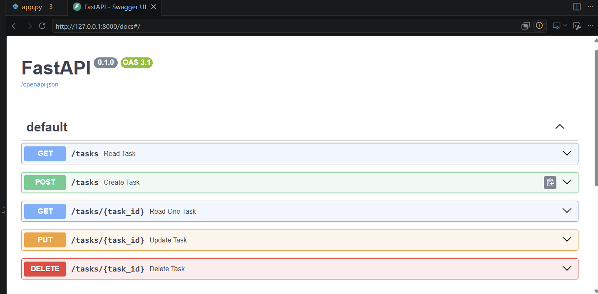
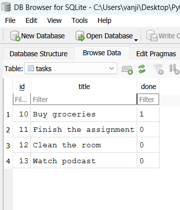

## Task CRUD API
## Connecting to the database

In memory task list of a CRUD API replaced with real SQLite database.
Sqlite database is used as it is a light weight database stored in a single file,no separate server process to install/run, good fit for a small learning project and easy to inspect with a GUI tool.Beginner project to learn SQL Queries for CRUD operations.

## Setup
1. Install dependencies: `uv sync`
2. Run app: `uv run fastapi dev app.py`

## Python

Database: SQLite
Library: sqlite3
Database file: tasks.db

The database file `tasks.db` is created automatically in the project root the first time the app starts (see `init_db()` in `app.py`). It is excluded from git via `.gitignore`.

## API Endpoints Reference

| Method | Endpoint | Description | 
| :--- | :---: | :--- | 
| `GET` | `/tasks` | Fetches all tasks | 
| `GET` | `/tasks/{tasks_id}` | Fetches a specific task by ID |
| `POST` | `/tasks` | Creates a new task | 
| `PUT` | `/tasks/{tasks_id}` | Updates a specific task by ID |
| `DELETE` | `/tasks/{tasks_id}` | Removes a task by ID |

## Example Query

While testing manually in DB Browser for SQLite, I ran:

​```sql
UPDATE tasks SET done = 1;
​```

This marked every task as completed, and confirmed via `GET /tasks` that the API immediately reflected the change — since both read from the same `tasks.db` file.



